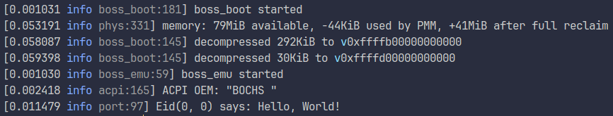

# BOSS
BOSS (BEAM-based Operating System with Security) is a proof-of-concept operating
system written in Erlang together with Rust. Its distinctive features include:
  - replacing the traditional kernel-userspace divide with Erlang's supervision
    tree model;
  - capability-based security from the ground up.



## Goals
  - learn Rust;
  - implement an Erlang VM;
  - implement the dumbest idea that came to my head at 3 in the morning;
  - have fun.

This project strives to achieve the following, in order of decreasing
importance:
  - have fun;
  - get the implementation to work;
  - make the implementation correct;
  - make the implementation fast.

### Urrr-lang?
Yes. Erlang is a very cool functional (at a low level) / object-oriented (at a
high level) concurrent language. Erlang makes it easy to write code that scales
almost effortlessly across multiple cores, processors or even machines. Existing
implementations of Erlang (most notably, the official BEAM virtual machine) are
very performant in both sequential and concurrent operations. This
implementation is not. Like, not at all. But it works and it's a starting point!

## Structure

### Emulator (`boss_emu` crate)
The basis of this project is the **emulator**, a multiprocessing-aware Erlang VM
that runs on bare hardware. It only implements the bare minimum it has to
implement in order to reach this objective; for example, it does parse some ACPI
tables (since that is required for multiprocessing to work) (or, at least, it
will once this feature is actually implemented), but it does not run AML
bytecode - that task is left up to the BEAM bytecode it runs. The emulator only
supports the x86_64 ISA, UEFI and ACPI 2.0+, i.e. it will run on machines from
approximately 2010 onwards. It could be argued that the emulator is a
microkernel since it implements the things a uK would (scheduling and IPC), but
it's my project and I prefer not to name it that.

Even though the emulator is _a_ BEAM, it's not _the_ BEAM. It is compatible with
Erlang's standard binary module format and its bytecode instructions, but that's
about where the similarities end. This incompatibility is a conscious design
decision that was made to introduce isolation and capability-based security into
the BEAM. Here's an incomplete list of the differences:
  - In OTP, an application is a code-level abstraction; it does not exist in the
    virtual machine. In OTP, only one version of an application may be loaded at
    the same time, and only one instance of that application may be running at
    the same time. In BOSS, applications (but not app instances) exist at the
    emulator level.
  - In OTP, modules are global. In BOSS, modules are namespaced to a particular
    application, and isolation between them is enforced by the emulator.
    External calls to modules in other applications are termed "far calls", are
    not always allowed and demand a special module name:
    ```erl
    % this calls the function `baz' from the module `bar' in the application `foo'
    % this will only be allowed if `foo' "exports" the module `bar'
    'foo:bar':baz(). % far call
    % this calls the function `baz' from the module `bar' in the current app
    bar:baz(). % external call
    % this calls the function `baz' from the current module in the current app
    baz(). % local call
    ```
  - In OTP, messages are sent to ports and processes as-is. In BOSS, the
    sender's id (whatever it is, a pid or a port) is transparently appended to
    the message:
    ```erl
    Self = self(),
    Self ! hello,
    receive
      {Self, hello} -> yay;
      hello -> nay
    end.
    ```
  - In OTP, every module and every function is trusted to do anything. In BOSS,
    every at least slightly privileged operation requires an access token, thus
    breaking compatibility with many BIFs. Access tokens cannot be forged, but
    can be shared and subdivided into a finer-grained permission set.

The current implementation is not the fastest, but it's a starting point to get
things working.

### Common (`boss_common` crate)
Contains Hardware Abstraction Layers for platforms and various utilities. Both
the emulator and the bootloader depend on this crate to do their jobs.

### Bootloader (`boss_boot` crate)
Initializes memory management, decompresses embedded images and executes the
emulator.

### Base image
On startup, the emulator loads the **BOSS base image** (`BOSBAIMA.TAR`) that
contains initial emulator configuration and just enough BEAM modules to
bootstrap a functional OS. It's akin to OTP's `kernel` app.

### Everything else
As was previously said, there is no clear kernel-userspace divide; instead, BOSS
goes for the supervision tree model that forms the basis of Erlang/OTP.

## Checklist
Emulator:
  - [x] Hello, World!
  - [x] The hardware world
    - [x] Logging
    - [x] Physical memory management
    - [x] Virtual memory management
    - [x] Interrupt handling
    - [x] Heap - MVP
    - [ ] Memory caching support
    - [x] Basic ACPI parser
    - [ ] APIC driver
    - [ ] SMP
  - [x] The BEAM world
    - [x] BEAM bytecode parsing
    - [x] BEAM code execution (45/125 opcodes)
    - [x] Basic ports - MVP
    - [ ] Advanced ports
    - [ ] Performance enhancements
    - [ ] Secure NIFs in ring 3
    - [ ] Compatibility sandbox for OTP applications

Base image:
  - [x] Hello, World!
  - [ ] Standard library
  - [ ] Basic drivers:
    - [ ] UEFI GOP
    - [ ] PS/2
    - [ ] AHCI
    - [ ] FAT32
  - [ ] Logging
  - [ ] Code management
  - [ ] Application support

"Userland":
  - [ ] Hello, World!
  - [ ] A GUI, probably?
  - [ ] Other things

## I wanna run it!!!!
Currently, the OS does not display anything on the screen. Instead, refer to
output from the serial port. [Nix](#build-using-nix) and
[Just](#build-using-just) scripts instruct QEMU to redirect serial port output
to the terminal.

### Download
You can download an ISO built from the latest commit over on the
[Releases](https://github.com/portasynthinca3/boss/releases) page. However, I
suggest that you instead build the OS from scratch.

### Build using Nix
Clone the project with:
```shell
$ git clone https://github.com/portasynthinca3/boss.git
$ cd boss
```

Build an ISO with:
```shell
$ nix --extra-experimental-features flakes build .#iso
```

Launch in QEMU with:
```shell
$ nix --extra-experimental-features flakes --extra-experimental-features nix-command run
```

### Build using Just
Clone the project with:
```shell
$ git clone https://github.com/portasynthinca3/boss.git
$ cd boss
```

To build an ISO, you will need:
  - Just v1.x (tested with `1.33.0`)
  - GNU MTools v4.x (tested with `4.0.44`)
  - GNU binutils v2.x (tested with `2.42.0`)
  - Rust v1.82-nightly (tested with `1.82.0-nightly (7120fdac7 2024-07-25)`)
  - Erlang/OTP 27 (tested with `Erlang/OTP 27 [erts-15.0.1]`, 26 and below will
    _not_ work)

Build an ISO with:
```shell
$ just iso
```

To run the ISO in QEMU, you will need:
  - All the other things needed for building an ISO
  - QEMU
  - OVMF (or other UEFI firmware for QEMU)

Launch QEMU with:
```shell
$ just qemu
```

## Credits
Thank you to (in no specific order):
  - [@magistau](https://github.com/magistau) for helping me understand Rust and
    adding a Nix flake (which I unfortunately had subsequently removed)
  - [@polina4096](https://github.com/polina4096) for helping me understand Rust
  - [@shdown](https://github.com/shdown) for helping with the algorithm for the
    `gen_perm:subset/2` function (`apps/base/src/gen_perm.erl`)
  - [The BEAM Book](https://github.com/happi/theBeamBook) for documenting the
    original BEAM virtual machine
